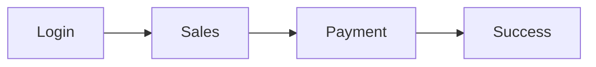

# NDTCore.POS

> Product Design Documentation

Version: 1.0.0

Status: Draft

Owner: Product Team

Last Updated: YYYY-MM-DD

---

# 1. Giới thiệu

Đây là bộ tài liệu đặc tả thiết kế (Product Design Specification) dành cho hệ thống **NDTCore.POS**.

Tài liệu mô tả toàn bộ giao diện, trải nghiệm người dùng, quy tắc nghiệp vụ, luồng thao tác và đặc tả kỹ thuật của ứng dụng POS dành cho Android Tablet.

Bộ tài liệu này là **Single Source of Truth**, được sử dụng xuyên suốt vòng đời phát triển sản phẩm.

Mọi quyết định liên quan đến UI, UX, hành vi hệ thống hoặc nghiệp vụ đều phải tham chiếu từ bộ tài liệu này.

---

# 2. Mục tiêu

Tài liệu giúp:

- Thống nhất cách hiểu giữa Product, UI/UX, Frontend, Backend và QA.
- Giảm trao đổi lặp lại trong quá trình phát triển.
- Chuẩn hóa thiết kế giao diện.
- Chuẩn hóa trải nghiệm người dùng.
- Chuẩn hóa Business Rules.
- Hỗ trợ QA viết Test Case.
- Hỗ trợ Designer thiết kế Figma.
- Hỗ trợ Developer triển khai đúng thiết kế.

---

# 3. Đối tượng sử dụng

| Vai trò | Mục đích |
|----------|----------|
| Product Owner | Quản lý yêu cầu |
| Business Analyst | Phân tích nghiệp vụ |
| UI Designer | Thiết kế giao diện |
| UX Designer | Thiết kế trải nghiệm |
| Frontend Developer | Triển khai UI |
| Backend Developer | Hiểu luồng nghiệp vụ |
| QA | Viết Test Case |
| Project Manager | Theo dõi tiến độ |

---

# 4. Phạm vi tài liệu

Tài liệu bao gồm toàn bộ đặc tả của hệ thống POS.

Bao gồm:

- Product Overview
- Design Principles
- Design System
- UX Guidelines
- Information Architecture
- User Journey
- Screen Specification
- Component Specification
- Business Rules
- Responsive Design
- Accessibility
- Animation
- Performance
- Acceptance Criteria
- Wireframe
- Flow Diagram

Không bao gồm:

- Source Code
- API Specification
- Database Schema
- Backend Architecture
- DevOps
- CI/CD

---

# 5. Phạm vi sản phẩm

Ứng dụng:

NDTCore.POS

Lĩnh vực:

- Bubble Tea
- Coffee
- Beverage
- Restaurant

Thiết bị:

Android Tablet

Landscape

1280 × 800

Thiết bị phụ:

Android Phone

Layout độc lập.

Không scale từ Tablet.

---

# 6. Mục tiêu thiết kế

Thiết kế phải đáp ứng các tiêu chí sau.

## 6.1 Tốc độ

Thu ngân phải hoàn thành một đơn hàng trong thời gian ngắn nhất.

Mọi thao tác dư thừa phải được loại bỏ.

## 6.2 Touch First

Toàn bộ UI được tối ưu cho thao tác cảm ứng.

Không phụ thuộc chuột.

Không yêu cầu bàn phím vật lý.

## 6.3 Dễ học

Người mới có thể sử dụng sau vài phút hướng dẫn.

Các hành động quen thuộc phải nhất quán.

## 6.4 Hiệu quả

Các thao tác được thực hiện với số lần chạm tối thiểu.

Ví dụ:

- Chọn Category
- Chọn Product
- Modifier
- Thanh toán

Không có bước trung gian không cần thiết.

## 6.5 Enterprise

Hệ thống đủ khả năng mở rộng:

- nhiều cửa hàng
- nhiều máy in
- nhiều loại thanh toán
- nhiều vai trò
- nhiều tenant

---

# 7. Quy ước tài liệu

## Tiêu đề

Sử dụng Heading Markdown.

```md
# Level 1

## Level 2

### Level 3

#### Level 4
```

---

## Wireframe

Toàn bộ Wireframe sử dụng ASCII.

Ví dụ

```text
┌──────────────┐
│ Product Card │
└──────────────┘
```

---

## Diagram

Ưu tiên Mermaid.

Ví dụ



---

## Table

Sử dụng Markdown Table.

Ví dụ

| Property | Value |
|-----------|-------|
| Width | 320dp |

---

# 8. Quy tắc đặt tên

## Screen

Sử dụng PascalCase.

Ví dụ

SalesScreen

PaymentScreen

ModifierScreen

---

## Component

Ví dụ

ProductCard

CartItem

SearchBar

PaymentFooter

---

## State

Ví dụ

Idle

Loading

Selected

Focused

Pressed

Disabled

Offline

Error

Success

---

## Event

Ví dụ

onClick()

onLongPress()

onSearch()

onQuantityChanged()

---

# 9. Cấu trúc tài liệu

```
docs/

README.md

01-product-overview.md

02-design-principles.md

03-design-system.md

04-information-architecture.md

05-user-journey.md

06-ux-specification.md

07-business-rules.md

08-responsive.md

09-accessibility.md

10-design-tokens.md

11-animation.md

12-performance.md

13-appendix.md

screens/

components/

flows/

wireframes/

qa/
```

---

# 10. Quy tắc cập nhật

Mọi thay đổi UI hoặc UX phải cập nhật tài liệu trước khi triển khai.

Không được thay đổi Figma hoặc Source Code mà không cập nhật tài liệu.

Mọi Pull Request liên quan đến giao diện phải tham chiếu tới phần tài liệu tương ứng.

---

# 11. Versioning

Áp dụng Semantic Versioning.

| Version | Ý nghĩa |
|----------|----------|
| Major | Thay đổi lớn |
| Minor | Thêm tính năng |
| Patch | Sửa lỗi |

Ví dụ:

1.0.0

1.1.0

1.1.3

2.0.0

---

# 12. Quy trình làm việc

```text
Business Requirement
        │
        ▼
Product Specification
        │
        ▼
UI / UX Design
        │
        ▼
Review
        │
        ▼
Figma
        │
        ▼
Frontend Development
        │
        ▼
Backend Integration
        │
        ▼
QA Testing
        │
        ▼
Release
```

---

# 13. Tài liệu liên quan

| Tài liệu | Mục đích |
|----------|----------|
| 01-product-overview.md | Tổng quan sản phẩm |
| 02-design-principles.md | Triết lý thiết kế |
| 03-design-system.md | Design System |
| screens/ | Đặc tả màn hình |
| components/ | Đặc tả Component |
| flows/ | User Flow |
| wireframes/ | Wireframe |
| qa/ | Acceptance Criteria |

---

# 14. Quy ước thuật ngữ

| Thuật ngữ | Ý nghĩa |
|-----------|----------|
| POS | Point of Sale |
| Cart | Giỏ hàng |
| Modifier | Tùy chọn sản phẩm |
| Variant | Biến thể sản phẩm |
| Category | Danh mục |
| Receipt | Hóa đơn |
| Kitchen Ticket | Phiếu bếp |
| Hold Order | Giữ đơn |
| Split Payment | Thanh toán nhiều phương thức |
| Tenant | Đơn vị vận hành trong hệ thống đa tenant |

---

# 15. Changelog

## v1.0.0

- Khởi tạo bộ Product Design Documentation.
- Định nghĩa cấu trúc tài liệu.
- Thiết lập quy ước và phạm vi sử dụng.

---

# 16. Tài liệu tiếp theo

Sau khi đọc README, tiếp tục theo thứ tự:

1. 01-product-overview.md
2. 02-design-principles.md
3. 03-design-system.md
4. 04-information-architecture.md
5. 05-user-journey.md
6. ...

Khuyến nghị đọc theo đúng thứ tự để hiểu đầy đủ bối cảnh sản phẩm trước khi đi vào đặc tả chi tiết từng màn hình và component.