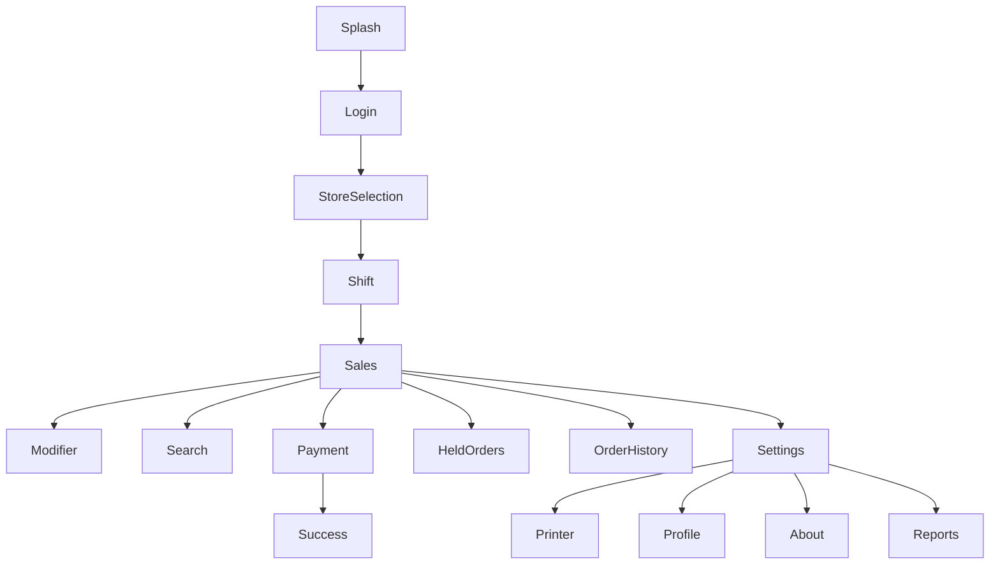

# NDTCore.POS

# Information Architecture

Version: 1.0.0

---

# 1. Mục đích

## 1.1 Giới thiệu

Information Architecture (IA) định nghĩa cấu trúc tổng thể của ứng dụng NDTCore.POS.

Mục tiêu của IA là:

- Tổ chức chức năng theo nhóm hợp lý.
- Giảm số cấp điều hướng.
- Giúp người dùng tìm được chức năng nhanh.
- Hỗ trợ mở rộng sản phẩm trong tương lai.
- Là cơ sở để xây dựng Navigation và Wireframe.

---

## 1.2 Nguyên tắc

Kiến trúc thông tin phải đảm bảo:

- Đơn giản.
- Dễ hiểu.
- Điều hướng nông (Shallow Navigation).
- Không quá 3 cấp màn hình.
- Chức năng liên quan được nhóm cùng nhau.
- Hạn chế chuyển màn hình không cần thiết.

---

# 2. Kiến trúc tổng thể

```text
NDTCore.POS
│
├── Authentication
│   ├── Splash
│   ├── Login
│   └── Store Selection
│
├── Shift
│   ├── Open Shift
│   └── Close Shift
│
├── Sales
│   ├── Sales Screen
│   ├── Search
│   ├── Product Detail
│   ├── Modifier
│   ├── Payment
│   └── Success
│
├── Orders
│   ├── Held Orders
│   ├── Order History
│   ├── Receipt
│   └── Refund
│
├── Printer
│   ├── Printer Management
│   ├── Add Printer
│   ├── Discovery
│   ├── Printer Detail
│   ├── Test Print
│   └── Kitchen Printer
│
├── Reports
│   └── Daily Report
│
└── Settings
    ├── General
    ├── Profile
    ├── About
    ├── Sync
    └── Update
```

---

# 3. Module Hierarchy

| Module | Mô tả | Mức ưu tiên |
|----------|---------|-------------|
| Authentication | Đăng nhập | Cao |
| Shift | Quản lý ca | Cao |
| Sales | Bán hàng | Rất cao |
| Orders | Quản lý đơn | Cao |
| Printer | Máy in | Cao |
| Reports | Báo cáo | Trung bình |
| Settings | Cấu hình | Trung bình |

---

# 4. Navigation Hierarchy



---

# 5. Screen Hierarchy

## Cấp 1 (Primary Screens)

Đây là các màn hình chính mà người dùng truy cập thường xuyên.

- Sales
- Orders
- Reports
- Settings

---

## Cấp 2 (Secondary Screens)

Là các màn hình phục vụ thao tác trên màn hình chính.

Ví dụ:

Sales

↓

Modifier

↓

Payment

↓

Success

---

## Cấp 3 (Dialog / Overlay)

Không được coi là màn hình độc lập.

Ví dụ:

- Confirm Dialog
- Printer Dialog
- Discount Dialog
- Customer Dialog

---

# 6. Feature Hierarchy

```text
Sales

├── Category
├── Search
├── Product Grid
├── Cart
├── Modifier
├── Discount
├── Payment
└── Receipt
```

---

# 7. Sales Architecture

```text
Sales Screen

├── Top Bar
├── Category Tabs
├── Search Bar
├── Product Grid
├── Cart Panel
└── Payment Footer
```

Mỗi khu vực chỉ đảm nhận một nhiệm vụ duy nhất.

---

# 8. Settings Architecture

```text
Settings

├── Profile
├── Printer
├── Language
├── Sync
├── Theme
├── About
└── Version
```

---

# 9. Printer Architecture

```text
Printer

├── Printer List
├── Add Printer
├── Discovery
├── Detail
├── Test Print
└── Kitchen Routing
```

---

# 10. Permission Hierarchy

| Vai trò | Sales | Reports | Settings | Printer | Refund |
|----------|-------|----------|----------|----------|---------|
| Cashier | ✔ | ✖ | ✖ | ✖ | ✖ |
| Supervisor | ✔ | ✔ | Một phần | ✔ | ✔ |
| Manager | ✔ | ✔ | ✔ | ✔ | ✔ |
| Admin | ✔ | ✔ | ✔ | ✔ | ✔ |

---

# 11. Navigation Rules

- Không quá 3 cấp điều hướng.
- Người dùng luôn biết mình đang ở đâu.
- Có thể quay lại màn hình trước.
- Không có vòng lặp điều hướng.
- Các hành động chính luôn xuất phát từ màn hình Sales.

---

# 12. Information Grouping

Thông tin được chia thành các nhóm:

## Nhóm giao dịch

- Sản phẩm
- Giỏ hàng
- Thanh toán

## Nhóm quản trị

- Báo cáo
- Máy in
- Cài đặt

## Nhóm hệ thống

- Đồng bộ
- Phiên bản
- Giới thiệu

---

# 13. Nguyên tắc mở rộng

Kiến trúc phải cho phép bổ sung:

- Module Loyalty
- Module Membership
- Module Delivery
- Module Inventory
- Module CRM

mà không ảnh hưởng đến cấu trúc điều hướng hiện tại.

---

# 14. Acceptance Criteria

- Tất cả chức năng được nhóm hợp lý.
- Không có màn hình mồ côi (Orphan Screen).
- Điều hướng không vượt quá 3 cấp.
- Người dùng luôn xác định được vị trí hiện tại.
- Có thể mở rộng thêm module mà không cần thay đổi IA.
- IA hỗ trợ đầy đủ các vai trò: Cashier, Supervisor, Manager và Admin.